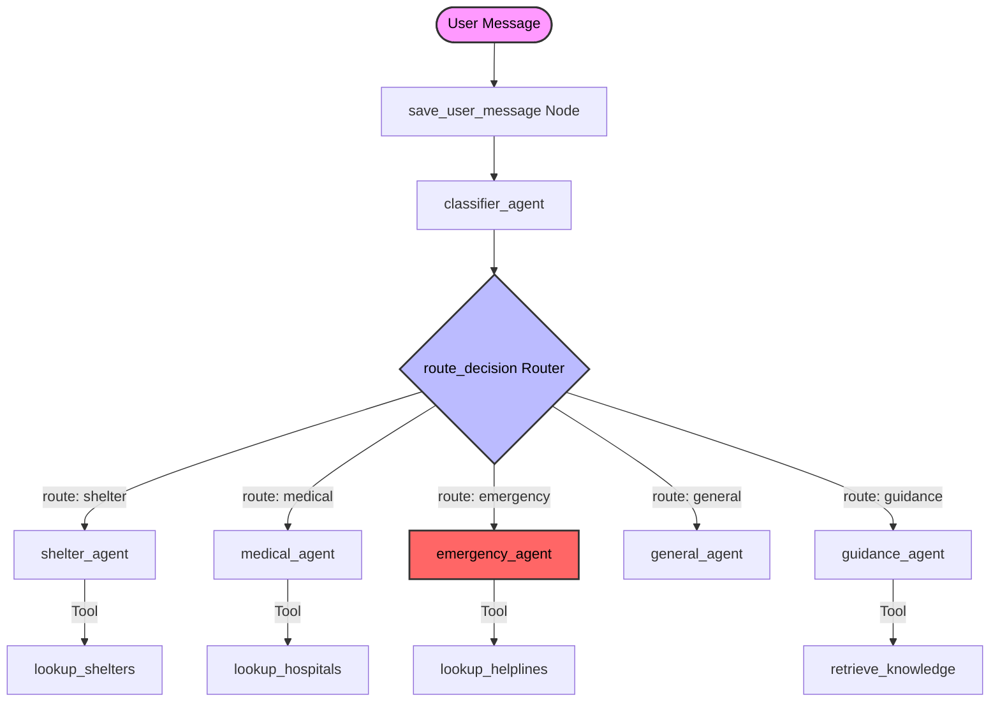

# 🌊 Kerala Disaster Relief Resource Agent

An AI-powered, state-of-the-art multi-agent emergency dispatcher built with the **Google ADK (Agent Development Kit)** and **Gradio**. 

This system acts as a real-time AI emergency coordinator. It intelligently analyzes natural language distress queries, automatically resolves critical vulnerabilities, maps locations, and routes the requests to specialized, tool-enabled agents (for shelter lookup, medical emergency services, or local disaster guidance) using low-latency streaming.

---

## 🏗️ Multi-Agent Architecture

The dispatcher is built on a directed acyclic graph (DAG) workflow using **Google ADK 2.0**. The session state and chat history persist across turns, allowing the system to maintain the context of the conversation.

### Workflow Routing Topology



### Context & State Flow

1. **User Message Interception (`save_user_message`):** Intercepts the raw user query at the `START` node and commits it to the session context (`ctx.state["user_message"]`).
2. **Intent Classification (`classifier_agent`):** Classifies request route, priority, vulnerability indicators, and disaster type using a structured Pydantic schema (`ClassificationResult`).
3. **Escalation & Memory Router (`route_decision`):** 
   - Intercepts classification outputs.
   - Evaluates escalation rules (triggers immediate routing to `emergency_agent` if the user is pregnant, elderly, disabled, has infants, is unconscious, has chest pain, or faces blocked roads).
   - Resolves follow-up query contexts (maintains active flows when receiving short answers like district names).
   - Forwards the user's original message to downstream agents instead of raw classification JSON.
4. **Agent Execution:** The designated agent executes, calls its database search tools (with fuzzy spelling match tolerances), and streams markdown responses to the UI.

---

## 🤖 Specialized Agents

| Agent Name | Role / Focus | Integrated Tools | Dynamic System Prompts |
|---|---|---|---|
| **Classifier Agent** | Analyzes intents, priority levels, and vulnerability markers. | *None (Structured JSON Output)* | [CLASSIFIER_INSTRUCTION](file:///c:/PROJECTS/Disaster-adk/disaster-relief/app/prompts.py#L3) |
| **Shelter Agent** | Finds active relief camps, provides evacuation instructions, and lists packing checklists. | [lookup_shelters](file:///c:/PROJECTS/Disaster-adk/disaster-relief/app/tools.py#L10) | [SHELTER_INSTRUCTION](file:///c:/PROJECTS/Disaster-adk/disaster-relief/app/prompts.py#L27) |
| **Medical Agent** | Recommends nearby hospitals with ICU support and provides basic first-aid guides. | [lookup_hospitals](file:///c:/PROJECTS/Disaster-adk/disaster-relief/app/tools.py#L63) | [MEDICAL_INSTRUCTION](file:///c:/PROJECTS/Disaster-adk/disaster-relief/app/prompts.py#L42) |
| **Emergency Agent** | Handles critical distress, providing immediate helplines and safety directives. | [lookup_helplines](file:///c:/PROJECTS/Disaster-adk/disaster-relief/app/tools.py#L114) | [EMERGENCY_INSTRUCTION](file:///c:/PROJECTS/Disaster-adk/disaster-relief/app/prompts.py#L58) |
| **General Agent** | Greets users warmly and helps them onboard/understand system capabilities. | *None* | [GENERAL_INSTRUCTION](file:///c:/PROJECTS/Disaster-adk/disaster-relief/app/prompts.py#L73) |
| **Guidance Agent** | RAG-based lookup over official recovery procedures and sanitation guidelines. | [retrieve_knowledge](file:///c:/PROJECTS/Disaster-adk/disaster-relief/app/rag_pipeline.py#L94) | [GUIDANCE_INSTRUCTION](file:///c:/PROJECTS/Disaster-adk/disaster-relief/app/prompts.py#L78) |

---

## 🔑 Advanced Engineering Implementations

### 1. Interception & Context Flow (Data Integrity)
In complex multi-agent graphs, downstream agents often lose context because they receive the raw structured JSON of the classifier as input. We implemented the [save_user_message](file:///c:/PROJECTS/Disaster-adk/disaster-relief/app/agent.py#L105) node at the workflow root to store the raw user text, allowing [route_decision](file:///c:/PROJECTS/Disaster-adk/disaster-relief/app/agent.py#L114) to pass the original user query text downstream instead of the classification JSON.

### 2. Session Memory Continuity (No Loops)
When asked for a district, users often respond with single words (e.g., *"Ernakulam"*). The classifier would normally flag a single-word location as a `general` greeting and reset the loop. We implemented state-tracking rules in [route_decision](file:///c:/PROJECTS/Disaster-adk/disaster-relief/app/agent.py#L138):
```python
prev_route = ctx.state.get("route")
if route == "general" and prev_route and prev_route != "general":
    route = prev_route
```
This forces the workflow to keep the active specialized flow (e.g. `shelter` or `medical`) when processing location updates.

### 3. Tolerant Database Fuzzy Matching
Both shelter and hospital databases use Python's `difflib` with a `0.5` similarity cutoff. This allows the system to correctly handle typos, common misspellings, or abbreviations (e.g. mapping `"Ermakulam"` to `"Ernakulam"`, or `"Alapuzha"` to `"Alappuzha"`). System prompts are configured to trust the tool-side matching, ensuring agents do not gatekeep misspelled queries.

---

## 📁 Project Directory Structure

```
disaster-relief/
├── app/
│   ├── agent.py          # Workflow graph, custom nodes, routing rules
│   ├── prompts.py        # System instructions and prompts for all agents
│   ├── tools.py          # Database lookup functions (fuzzy matching)
│   ├── ui.py             # Gradio ChatInterface, SSE streams, deduplication rules
│   ├── fast_api_app.py   # FastAPI backend alternative
│   ├── rag_pipeline.py   # NumPy-based vector search implementation
│   ├── data/
│   │   ├── shelters.json      # Mock Kerala relief camps
│   │   ├── hospitals.json     # Mock Kerala hospitals database
│   │   ├── helplines.json     # State control rooms and helpline directories
│   │   └── rag_index.npz      # Compiled guidelines embedding index
│   └── knowledge_base/
│       └── recovery_guidelines.txt  # Disinfection & water purification rules
├── tests/
│   └── unit/
│       └── test_dummy.py      # Basic check suite
├── .env.example          # Environment template
├── pyproject.toml        # Dependency definitions (Gradio, Google ADK)
└── Dockerfile            # Container configuration
```

---

## ⚙️ Setup & Execution

### 1. Configure Environment
Clone the project, then configure the `.env` file inside the `disaster-relief/` folder:
```env
GOOGLE_API_KEY=your_gemini_api_key
GOOGLE_GENAI_USE_VERTEXAI=False
GEMINI_MODEL=gemini-flash-latest
GRADIO_SERVER_PORT=8081
```

### 2. Local Launch
Execute the Gradio interface:
```bash
cd disaster-relief
uv sync
uv run python app/ui.py
```
Open your browser and navigate to **[http://localhost:8081](http://localhost:8081)**.

---

## 👥 Team & Contributions

This project was built by a collaborative team of engineers:

| Name | Role | Primary Contributions |
|---|---|---|
| **Asiya Muhammed Sali** | **Agent Architect** | Classifier agent, shelter agent, medical agent, emergency agent, and general agent — including ADK workflow graph definition, custom router/escalation logic, session memory continuity, and fuzzy lookup tools in [agent.py](file:///c:/PROJECTS/Disaster-adk/disaster-relief/app/agent.py), [tools.py](file:///c:/PROJECTS/Disaster-adk/disaster-relief/app/tools.py) & [prompts.py](file:///c:/PROJECTS/Disaster-adk/disaster-relief/app/prompts.py). |
| **Athira V** | **RAG & Knowledge Engineer** | RAG indexing pipeline, NumPy-based vector retrieval, guidance agent integration, and knowledge base curation in [rag_pipeline.py](file:///c:/PROJECTS/Disaster-adk/disaster-relief/app/rag_pipeline.py) & [knowledge_base/](file:///c:/PROJECTS/Disaster-adk/disaster-relief/app/knowledge_base/). |

---

## 🗓️ Development Log

- **scaffold:** Initialized package structure and scaffolding using `google-agents-cli`.
- **v1.0 (MVP):** Added the Emergency Classifier, Shelter lookup databases, and hospital database search logic.
- **v1.1 (Escalation & RAG):** Integrated automatic vulnerability escalation (pregnancy, infants, elderly) and local guidelines vector search.
- **v1.2 (Bugfixes):** Fixed loop repetitions when entering locations, resolved content output duplication in the stream, and fixed 429 rate limit exceptions.
